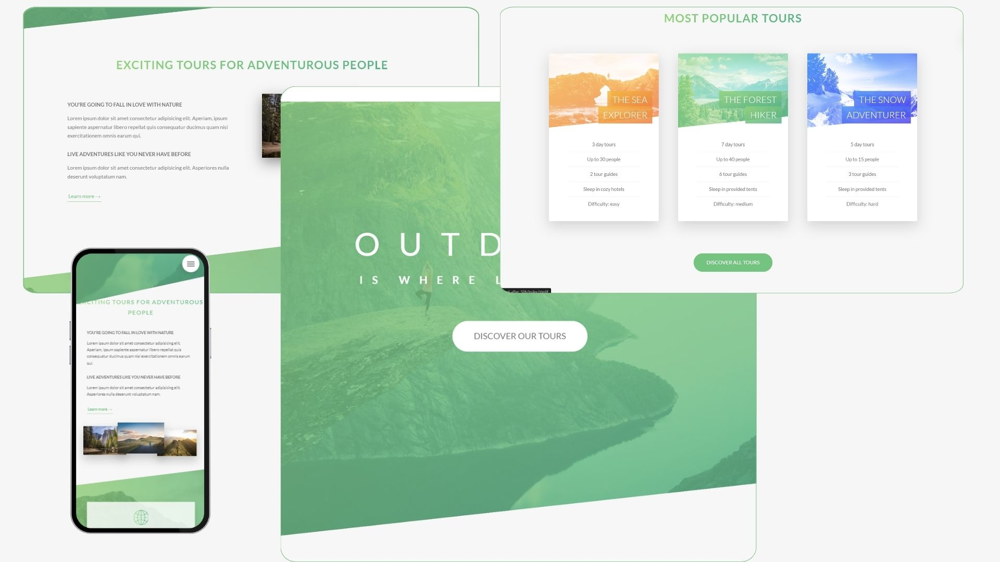

# Natours | Exciting Tours for Adventurous People

Natours is a web project that offers exciting tours for adventurous people. It provides users with detailed information about various tours, allows them to book tours, and shares stories from people who have experienced the tours. This project demonstrates the use of advanced CSS and Sass for creating a beautiful and responsive web design.

### Visit the website here [Natours](https://natours-mz.vercel.app/).

## Technologies Used

- HTML
- SASS / CSS

## Features

- **Responsive Design**: The website is fully responsive, providing a seamless experience across different devices.
- **Navigation Menu**: A stylish and interactive navigation menu.
- **Tour Information**: Detailed information about various tours.
- **Booking Form**: A form to book tours.
- **User Stories**: Stories from people who have taken the tours.
- **Background Video**: A beautiful background video to enhance the visual appeal.
- **CSS Grid and Flexbox**: Utilizes CSS Grid and Flexbox for layout management.

## Tech Stack

- **HTML**
- **CSS**
- **Sass**

_Built the project using advanced CSS and Sass. Jonas Schmedtmann - Original author and inspiration for the project design. Built using advanced CSS and Sass. A credit to the original author, Jonas Schmedtmann, is highly appreciated!_
